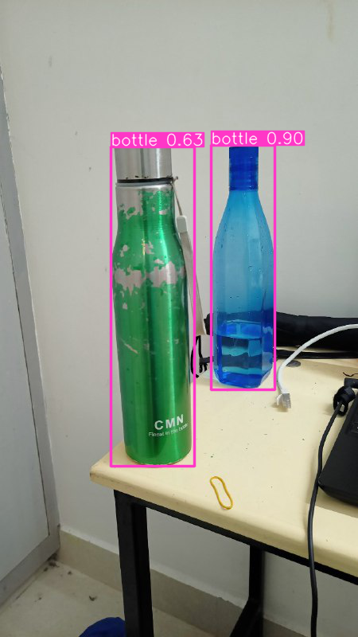

# Object-Detection

This is a simple object detection program for images using pytorch, Yolov5.

## OUTPUT
```python
pip install -r requirements.txt
```

    Requirement already satisfied: ipython in c:\users\joelq\anaconda3\lib\site-packages (from -r requirements.txt (line 5)) (7.31.1)Note: you may need to restart the kernel to use updated packages.
    
    Requirement already satisfied: matplotlib>=3.2.2 in c:\users\joelq\anaconda3\lib\site-packages (from -r requirements.txt (line 6)) (3.5.2)
    Requirement already satisfied: numpy>=1.18.5 in c:\users\joelq\anaconda3\lib\site-packages (from -r requirements.txt (line 7)) (1.21.5)
    Requirement already satisfied: opencv-python>=4.1.1 in c:\users\joelq\anaconda3\lib\site-packages (from -r requirements.txt (line 8)) (4.6.0.66)
    Requirement already satisfied: Pillow>=7.1.2 in c:\users\joelq\anaconda3\lib\site-packages (from -r requirements.txt (line 9)) (9.2.0)
    Requirement already satisfied: psutil in c:\users\joelq\anaconda3\lib\site-packages (from -r requirements.txt (line 10)) (5.9.0)
    Requirement already satisfied: PyYAML>=5.3.1 in c:\users\joelq\anaconda3\lib\site-packages (from -r requirements.txt (line 11)) (6.0)
    Requirement already satisfied: requests>=2.23.0 in c:\users\joelq\anaconda3\lib\site-packages (from -r requirements.txt (line 12)) (2.28.1)
    Requirement already satisfied: scipy>=1.4.1 in c:\users\joelq\anaconda3\lib\site-packages (from -r requirements.txt (line 13)) (1.9.1)
    Requirement already satisfied: thop>=0.1.1 in c:\users\joelq\anaconda3\lib\site-packages (from -r requirements.txt (line 14)) (0.1.1.post2209072238)
    Requirement already satisfied: torch>=1.7.0 in c:\users\joelq\anaconda3\lib\site-packages (from -r requirements.txt (line 15)) (1.13.0)
    Requirement already satisfied: torchvision>=0.8.1 in c:\users\joelq\anaconda3\lib\site-packages (from -r requirements.txt (line 16)) (0.14.0)
    Requirement already satisfied: tqdm>=4.64.0 in c:\users\joelq\anaconda3\lib\site-packages (from -r requirements.txt (line 17)) (4.64.1)
    Requirement already satisfied: tensorboard>=2.4.1 in c:\users\joelq\anaconda3\lib\site-packages (from -r requirements.txt (line 21)) (2.11.0)
    Requirement already satisfied: pandas>=1.1.4 in c:\users\joelq\anaconda3\lib\site-packages (from -r requirements.txt (line 26)) (1.4.4)
    Requirement already satisfied: seaborn>=0.11.0 in c:\users\joelq\anaconda3\lib\site-packages (from -r requirements.txt (line 27)) (0.11.2)
    Requirement already satisfied: setuptools>=18.5 in c:\users\joelq\anaconda3\lib\site-packages (from ipython->-r requirements.txt (line 5)) (63.4.1)
    Requirement already satisfied: backcall in c:\users\joelq\anaconda3\lib\site-packages (from ipython->-r requirements.txt (line 5)) (0.2.0)
    Requirement already satisfied: matplotlib-inline in c:\users\joelq\anaconda3\lib\site-packages (from ipython->-r requirements.txt (line 5)) (0.1.6)
    Requirement already satisfied: pygments in c:\users\joelq\anaconda3\lib\site-packages (from ipython->-r requirements.txt (line 5)) (2.11.2)
    Requirement already satisfied: jedi>=0.16 in c:\users\joelq\anaconda3\lib\site-packages (from ipython->-r requirements.txt (line 5)) (0.18.1)
    Requirement already satisfied: pickleshare in c:\users\joelq\anaconda3\lib\site-packages (from ipython->-r requirements.txt (line 5)) (0.7.5)
    Requirement already satisfied: prompt-toolkit!=3.0.0,!=3.0.1,<3.1.0,>=2.0.0 in c:\users\joelq\anaconda3\lib\site-packages (from ipython->-r requirements.txt (line 5)) (3.0.20)
    Requirement already satisfied: traitlets>=4.2 in c:\users\joelq\anaconda3\lib\site-packages (from ipython->-r requirements.txt (line 5)) (5.1.1)
    Requirement already satisfied: colorama in c:\users\joelq\anaconda3\lib\site-packages (from ipython->-r requirements.txt (line 5)) (0.4.5)
    Requirement already satisfied: decorator in c:\users\joelq\anaconda3\lib\site-packages (from ipython->-r requirements.txt (line 5)) (5.1.1)
    Requirement already satisfied: python-dateutil>=2.7 in c:\users\joelq\anaconda3\lib\site-packages (from matplotlib>=3.2.2->-r requirements.txt (line 6)) (2.8.2)
    Requirement already satisfied: kiwisolver>=1.0.1 in c:\users\joelq\anaconda3\lib\site-packages (from matplotlib>=3.2.2->-r requirements.txt (line 6)) (1.4.2)
    Requirement already satisfied: cycler>=0.10 in c:\users\joelq\anaconda3\lib\site-packages (from matplotlib>=3.2.2->-r requirements.txt (line 6)) (0.11.0)
    Requirement already satisfied: pyparsing>=2.2.1 in c:\users\joelq\anaconda3\lib\site-packages (from matplotlib>=3.2.2->-r requirements.txt (line 6)) (3.0.9)
    Requirement already satisfied: packaging>=20.0 in c:\users\joelq\anaconda3\lib\site-packages (from matplotlib>=3.2.2->-r requirements.txt (line 6)) (21.3)
    Requirement already satisfied: fonttools>=4.22.0 in c:\users\joelq\anaconda3\lib\site-packages (from matplotlib>=3.2.2->-r requirements.txt (line 6)) (4.25.0)
    Requirement already satisfied: idna<4,>=2.5 in c:\users\joelq\anaconda3\lib\site-packages (from requests>=2.23.0->-r requirements.txt (line 12)) (3.3)
    Requirement already satisfied: urllib3<1.27,>=1.21.1 in c:\users\joelq\anaconda3\lib\site-packages (from requests>=2.23.0->-r requirements.txt (line 12)) (1.26.11)
    Requirement already satisfied: charset-normalizer<3,>=2 in c:\users\joelq\anaconda3\lib\site-packages (from requests>=2.23.0->-r requirements.txt (line 12)) (2.0.4)
    Requirement already satisfied: certifi>=2017.4.17 in c:\users\joelq\anaconda3\lib\site-packages (from requests>=2.23.0->-r requirements.txt (line 12)) (2022.9.14)
    Requirement already satisfied: typing-extensions in c:\users\joelq\anaconda3\lib\site-packages (from torch>=1.7.0->-r requirements.txt (line 15)) (4.3.0)
    Requirement already satisfied: protobuf<4,>=3.9.2 in c:\users\joelq\anaconda3\lib\site-packages (from tensorboard>=2.4.1->-r requirements.txt (line 21)) (3.20.3)
    Requirement already satisfied: google-auth<3,>=1.6.3 in c:\users\joelq\anaconda3\lib\site-packages (from tensorboard>=2.4.1->-r requirements.txt (line 21)) (2.14.1)
    Requirement already satisfied: wheel>=0.26 in c:\users\joelq\anaconda3\lib\site-packages (from tensorboard>=2.4.1->-r requirements.txt (line 21)) (0.37.1)
    Requirement already satisfied: absl-py>=0.4 in c:\users\joelq\anaconda3\lib\site-packages (from tensorboard>=2.4.1->-r requirements.txt (line 21)) (1.3.0)
    Requirement already satisfied: markdown>=2.6.8 in c:\users\joelq\anaconda3\lib\site-packages (from tensorboard>=2.4.1->-r requirements.txt (line 21)) (3.3.4)
    Requirement already satisfied: tensorboard-data-server<0.7.0,>=0.6.0 in c:\users\joelq\anaconda3\lib\site-packages (from tensorboard>=2.4.1->-r requirements.txt (line 21)) (0.6.1)
    Requirement already satisfied: google-auth-oauthlib<0.5,>=0.4.1 in c:\users\joelq\anaconda3\lib\site-packages (from tensorboard>=2.4.1->-r requirements.txt (line 21)) (0.4.6)
    Requirement already satisfied: werkzeug>=1.0.1 in c:\users\joelq\anaconda3\lib\site-packages (from tensorboard>=2.4.1->-r requirements.txt (line 21)) (2.0.3)
    Requirement already satisfied: tensorboard-plugin-wit>=1.6.0 in c:\users\joelq\anaconda3\lib\site-packages (from tensorboard>=2.4.1->-r requirements.txt (line 21)) (1.8.1)
    Requirement already satisfied: grpcio>=1.24.3 in c:\users\joelq\anaconda3\lib\site-packages (from tensorboard>=2.4.1->-r requirements.txt (line 21)) (1.50.0)
    Requirement already satisfied: pytz>=2020.1 in c:\users\joelq\anaconda3\lib\site-packages (from pandas>=1.1.4->-r requirements.txt (line 26)) (2022.1)
    Requirement already satisfied: six>=1.9.0 in c:\users\joelq\anaconda3\lib\site-packages (from google-auth<3,>=1.6.3->tensorboard>=2.4.1->-r requirements.txt (line 21)) (1.16.0)
    Requirement already satisfied: rsa<5,>=3.1.4 in c:\users\joelq\anaconda3\lib\site-packages (from google-auth<3,>=1.6.3->tensorboard>=2.4.1->-r requirements.txt (line 21)) (4.9)
    Requirement already satisfied: cachetools<6.0,>=2.0.0 in c:\users\joelq\anaconda3\lib\site-packages (from google-auth<3,>=1.6.3->tensorboard>=2.4.1->-r requirements.txt (line 21)) (5.2.0)
    Requirement already satisfied: pyasn1-modules>=0.2.1 in c:\users\joelq\anaconda3\lib\site-packages (from google-auth<3,>=1.6.3->tensorboard>=2.4.1->-r requirements.txt (line 21)) (0.2.8)
    Requirement already satisfied: requests-oauthlib>=0.7.0 in c:\users\joelq\anaconda3\lib\site-packages (from google-auth-oauthlib<0.5,>=0.4.1->tensorboard>=2.4.1->-r requirements.txt (line 21)) (1.3.1)
    Requirement already satisfied: parso<0.9.0,>=0.8.0 in c:\users\joelq\anaconda3\lib\site-packages (from jedi>=0.16->ipython->-r requirements.txt (line 5)) (0.8.3)
    Requirement already satisfied: wcwidth in c:\users\joelq\anaconda3\lib\site-packages (from prompt-toolkit!=3.0.0,!=3.0.1,<3.1.0,>=2.0.0->ipython->-r requirements.txt (line 5)) (0.2.5)
    Requirement already satisfied: pyasn1<0.5.0,>=0.4.6 in c:\users\joelq\anaconda3\lib\site-packages (from pyasn1-modules>=0.2.1->google-auth<3,>=1.6.3->tensorboard>=2.4.1->-r requirements.txt (line 21)) (0.4.8)
    Requirement already satisfied: oauthlib>=3.0.0 in c:\users\joelq\anaconda3\lib\site-packages (from requests-oauthlib>=0.7.0->google-auth-oauthlib<0.5,>=0.4.1->tensorboard>=2.4.1->-r requirements.txt (line 21)) (3.2.2)
    


```python
import torch
```


```python
model = torch.hub.load('ultralytics/yolov5', 'yolov5s')
```

    Using cache found in C:\Users\joelq/.cache\torch\hub\ultralytics_yolov5_master
    YOLOv5  2022-11-14 Python-3.9.13 torch-1.13.0+cpu CPU
    
    Downloading https://github.com/ultralytics/yolov5/releases/download/v6.2/yolov5s.pt to yolov5s.pt...
    


      0%|          | 0.00/14.1M [00:00<?, ?B/s]


    
    Fusing layers... 
    YOLOv5s summary: 213 layers, 7225885 parameters, 0 gradients
    Adding AutoShape... 
    


```python
  img = 'photo.jpg'
```


```python
results = model(img)
```


```python
results.show()
```


    

    


```python

```
